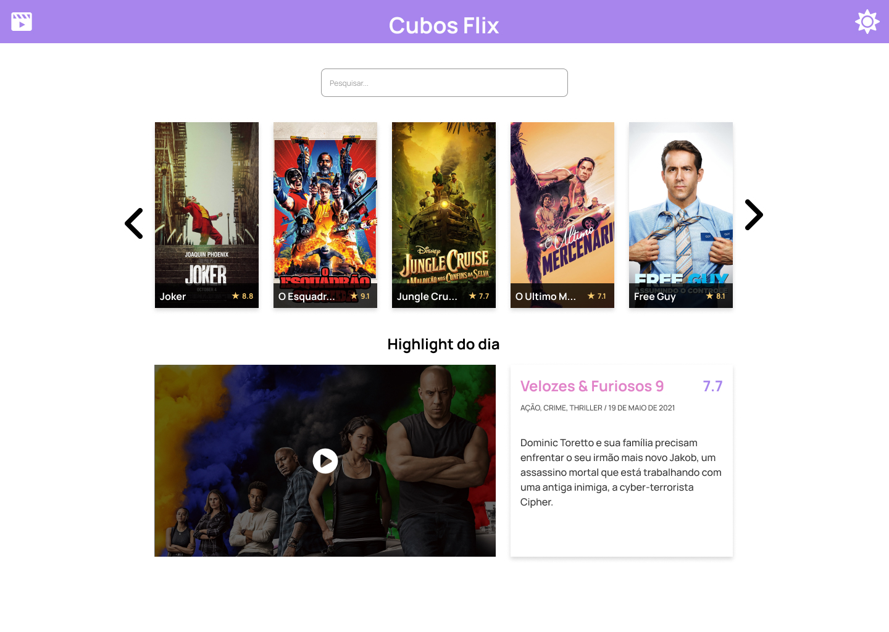
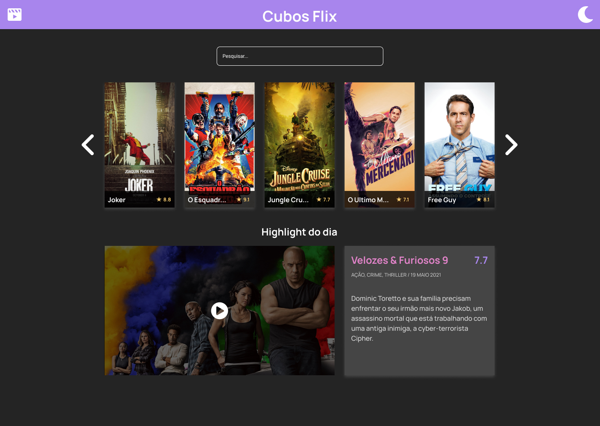
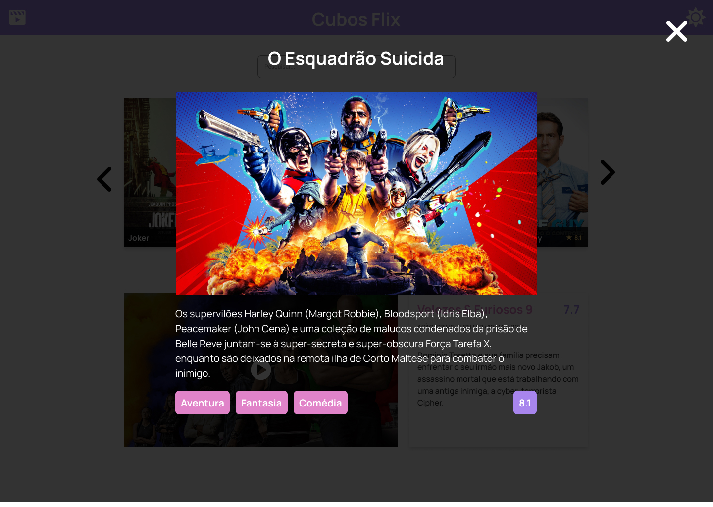

# Cubos Flix

It was my second challenge of Cubos Academy Full Stack Course. The project goal was to create a movie listing app that consumes an API and diplay some content about them.

## Goal

Rebuild the challenge using react and implement a few modifications to improve the usability using less code compared to my first attempt during the course.

## Figma Design

### Home - light Mode

### Home - dark Mode

### Movie Detail Modal

### New Features

I made a few modifications in the original design. They aew listed below:

- Responsive layout using Bootstrap
- Add a few categories to movies display (Action,Adventure and Comedy)
- SASS instead of using CSS

## Available Scripts

In the project directory, you can run:

### `npm run dev`

Runs the app in the development mode.\
Open [http://localhost:3000](http://localhost:3000) to view it in the browser.

The page will reload if you make edits.\
You will also see any lint errors in the console.
